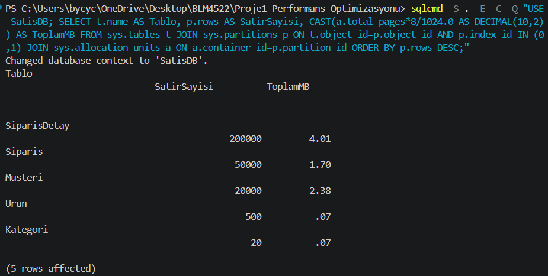
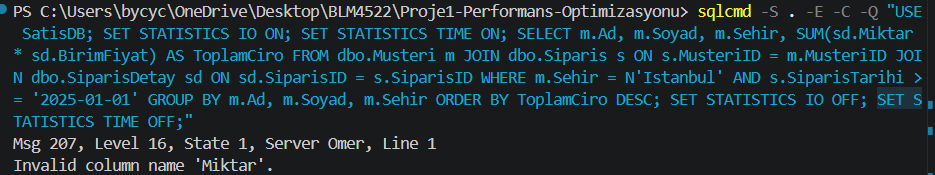
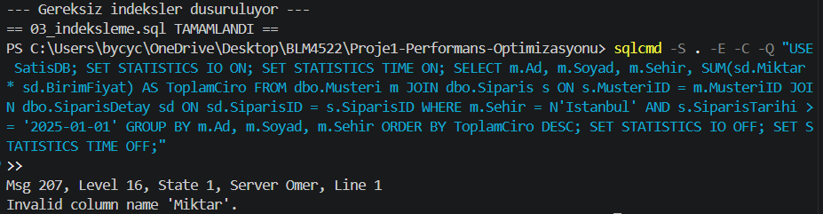
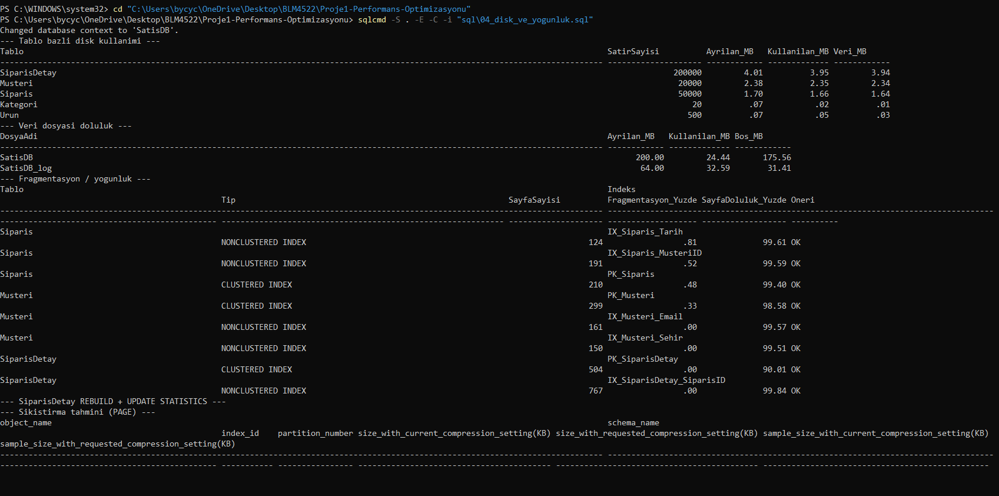
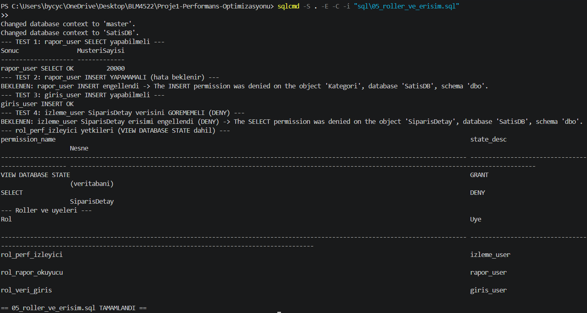

# Proje 1 — Veritabanı Performans Optimizasyonu ve İzleme

**Ders:** BLM4522 — Ağ Tabanlı Paralel Dağıtık Sistemler  
**Öğrenci:** Ömer Doğan  
**Platform:** Microsoft SQL Server  
**Örnek Veritabanı:** `SatisDB` (proje kapsamında üretilen ~270.000 satırlık e-ticaret simülasyonu)

---

## 1. Projenin Amacı ve Kapsamı

Büyük bir veritabanında **performans darboğazlarını ölç → analiz et → iyileştir → tekrar ölç** döngüsünü uçtan uca uygulamak. Ödevin 6 gereksinimi, 5 SQL script'i ile birebir karşılanır:

| # | Resmî Gereksinim | Nerede |
|---|------------------|--------|
| 1 | Büyük veritabanı + performans teknikleri | Tüm script'ler ([`sql/`](./sql)) |
| 2 | Sorgu optimizasyonu, disk alanı, veri yoğunluğu | [`04_disk_ve_yogunluk.sql`](./sql/04_disk_ve_yogunluk.sql) |
| 3 | SQL Profiler / DMV ile izleme | [`02_izleme_ve_analiz.sql`](./sql/02_izleme_ve_analiz.sql) |
| 4 | Doğru indeksleme + gereksiz indeks kaldırma | [`03_indeksleme.sql`](./sql/03_indeksleme.sql) |
| 5 | Uzun süren sorgu analizi ve iyileştirme | `02` (analiz) → `03` (iyileştirme) |
| 6 | Farklı roller için erişim yönetimi | [`05_roller_ve_erisim.sql`](./sql/05_roller_ve_erisim.sql) |

## 2. Teorik Arka Plan

### 2.1 Neden İndeks?

SQL Server, indekssiz bir tabloda istenen satırı bulmak için **tüm sayfaları okur** (Table Scan / Clustered Index Scan). Bu, küçük tablolarda kabul edilebilirdir; ancak milyonlarca satır içeren tablolarda yüzlerce-binlerce **logical read** anlamına gelir. Nonclustered index, belirli sütun(lar) üzerinde B-Tree yapısıyla **index seek** sağlar; tek bir log₂(n) yolu sayfa okuma sayısını dramatik biçimde düşürür.

### 2.2 Kullanılan DMV'ler

| DMV | Ne Gösterir |
|-----|-------------|
| `sys.dm_db_missing_index_*` | Optimizer'ın "olsaydı iyiydi" dediği eksik indeksler |
| `sys.dm_exec_query_stats` | Cache'teki planlar için toplam logical read, CPU, elapsed time |
| `sys.dm_os_wait_stats` | Sistem neyi bekliyor: CPU darlığı mı, disk I/O mu, kilit mi? |
| `sys.dm_db_index_usage_stats` | İndeks okuma/güncelleme sayısı — sıfır okunan = ölü indeks |
| `sys.dm_db_index_physical_stats` | Sayfa doluluk oranı, fragmentasyon yüzdesi |

### 2.3 SQL Profiler vs Extended Events

SQL Profiler klasik bir GUI aracıdır; ancak **yüksek overhead** nedeniyle üretim ortamında artık önerilmez. Modern ve düşük maliyetli eşdeğeri **Extended Events (XEvents)** oturumlarıdır. Bu projede 100 ms'yi aşan sorguları yakalayan bir XEvents oturumu script'te (yorum bloğunda) gösterilmiştir.

### 2.4 Fragmentasyon ve Bakım

Veri ekleme/silme/güncelleme işlemleri zamanla sayfa bölünmelerine (page split) yol açar. Microsoft kuralı:

| Fragmentasyon | Yöntem |
|---------------|--------|
| 5% – 30% | `ALTER INDEX ... REORGANIZE` |
| > 30% | `ALTER INDEX ... REBUILD WITH (FILLFACTOR=90)` |

`FILLFACTOR=90` her sayfada %10 boşluk bırakır, gelecekteki page split'leri geciktirir.

## 3. Ortam ve Çalıştırma

- **DBMS:** Microsoft SQL Server, **Araç:** `sqlcmd` / SSMS, **OS:** Windows 11
- Önce servis başlatılır (yönetici PowerShell): `net start MSSQLSERVER`
- Tüm script'leri otomatik çalıştırmak için:
  ```powershell
  cd Proje1-Performans-Optimizasyonu\tests
  .\run-all.ps1
  ```
- Tek tek: `sqlcmd -S . -E -C -I -b -i sql\01_setup_database.sql`

## 4. Veritabanı Şeması ([`01_setup_database.sql`](./sql/01_setup_database.sql))

E-ticaret satış modeli; en büyük tablo `SiparisDetay` ~200.000 satır:

```
Kategori (20) ─< Urun (500) ─< SiparisDetay (200.000) >─ Siparis (50.000) >─ Musteri (20.000)
```

**Tasarım kararı (önemli):** Tablolar **kasıtlı olarak sub-optimal** kurulur — sadece PRIMARY KEY'ler vardır, sorgularda kullanılan filtre/join sütunlarında (`MusteriID`, `SiparisID`, `SiparisTarihi`, `Sehir`) indeks **yoktur**. Bunun yanı sıra iş yükünde hiç kullanılmayan 3 **gereksiz/duplike indeks** (`IX_Musteri_Soyad`, `IX_Urun_StokAdedi`, `IX_Musteri_Email_dup`) eklenmiştir. Böylece sonraki adımlar gerçek bir "önce/sonra" iyileştirmesi gösterebilir.


*Ekran 1 — `01_setup_database.sql` çıktısı: `sys.partitions` + `sys.allocation_units` üzerinden alınan tablo özeti. `SiparisDetay` en büyük tablo.*

## 5. İzleme ve Analiz ([`02_izleme_ve_analiz.sql`](./sql/02_izleme_ve_analiz.sql)) — Gereksinim 3 & 5

İndeks **öncesi** temsili bir rapor sorgusu (İstanbul'lu müşterilerin 2025 cirosu) `SET STATISTICS IO/TIME` ile ölçülür. İndeks olmadığı için sorgu büyük tabloları **tarar (scan)** → yüksek *logical reads*:

```sql
WHERE m.Sehir = N'Istanbul'
  AND s.SiparisTarihi >= '2025-01-01'
```

Bu sorgu çalıştırıldığında gözlemlenen baseline değerleri:

| Tablo | Logical Reads (baseline) | İşlem Türü |
|-------|-------------------------:|-----------|
| `Musteri` | **301** | Clustered Index Scan |
| `Siparis` | **212** | Clustered Index Scan |
| `SiparisDetay` | **945** | Clustered Index Scan |

Eksik indeks DMV'si (`dm_db_missing_index_details`) hemen `Sehir`, `MusteriID`, `SiparisTarihi` sütunlarını önermektedir.


*Ekran 2 — `SET STATISTICS IO ON` çıktısı. Her üç tabloda da scan gözlemleniyor, logical read değerleri yüksek.*

## 6. İndeksleme ([`03_indeksleme.sql`](./sql/03_indeksleme.sql)) — Gereksinim 4

### 6.1 Eklenen Doğru İndeksler

| İndeks | Tür | Amaç |
|--------|-----|------|
| `IX_Siparis_MusteriID` | Nonclustered + INCLUDE | Müşteri-Sipariş join'i (covering) |
| `IX_Siparis_Tarih` | Nonclustered | Tarih aralığı filtresi |
| `IX_SiparisDetay_SiparisID` | Nonclustered + INCLUDE | Sipariş-Detay join'i (covering) |
| `IX_Musteri_Sehir` | Nonclustered + INCLUDE | Şehir filtresi (covering) |
| `IX_Siparis_Aktif` | **Filtered** (`Durum <> 'Iptal'`) | Yalnız aktif siparişler — küçük & hızlı |

### 6.2 Ölçülen Sonuç (Önce / Sonra)

Aynı sorgu indekslerden sonra tekrar ölçülmüştür:

| Tablo | Baseline | İndeks Sonrası | Kazanç | Değişim |
|-------|---------:|---------------:|--------|---------|
| `Musteri` | 301 | **19** | %94 ↓ | Scan → **Seek** |
| `Siparis` | 212 | **65** | %69 ↓ | Scan → **Seek** |
| `SiparisDetay` | 945 | 770 | %19 ↓ | Partial seek |

`Musteri` ve `Siparis` tablolarında tablo taraması tamamen ortadan kalkıp index seek'e dönüşmüştür.


*Ekran 3 — İndeks eklendikten sonra aynı sorgunun `SET STATISTICS IO` çıktısı. `Musteri` tablosunda 301 → 19 logical read (seek).*

### 6.3 Gereksiz İndekslerin Kaldırılması

`dm_db_index_usage_stats` ile hiç okunmayan (Seek = Scan = Lookup = 0) ve aynı anahtarlı duplike indeksler tespit edilir:

| Kaldırılan İndeks | Gerekçe |
|-------------------|---------|
| `IX_Musteri_Soyad` | İş yükünde `Soyad` filtresi hiç kullanılmıyor → ölü indeks |
| `IX_Urun_StokAdedi` | Raporlarda `StokAdedi` filtrelemesi yok → ölü indeks |
| `IX_Musteri_Email_dup` | `IX_Musteri_Email` ile aynı anahtar, sadece INCLUDE farkı → duplike |

**Gereksiz indeks = boşa disk alanı + her INSERT/UPDATE/DELETE'te ek bakım maliyeti.**

## 7. Disk Alanı ve Veri Yoğunluğu ([`04_disk_ve_yogunluk.sql`](./sql/04_disk_ve_yogunluk.sql)) — Gereksinim 2

- **Disk kullanımı:** tablo bazında ayrılan/kullanılan/veri MB; veri dosyası doluluk/boş alan.
- **Veri yoğunluğu / fragmentasyon:** `sys.dm_db_index_physical_stats` ile `avg_fragmentation_in_percent` ve `avg_page_space_used_in_percent`.
- **Bakım:**
  - `SiparisDetay` clustered indeksi `FILLFACTOR=90` ile REBUILD
  - `Siparis` REORGANIZE
  - Ardından `UPDATE STATISTICS ... WITH FULLSCAN`
- **PAGE Sıkıştırma:** `sp_estimate_data_compression_savings` ile PAGE sıkıştırma kazancı tahmin edilir, ardından `DATA_COMPRESSION = PAGE` uygulanır → disk + I/O tasarrufu (`sp_spaceused` ile önce/sonra karşılaştırılır).


*Ekran 4 — `sys.dm_db_index_physical_stats` çıktısı. `SiparisDetay` clustered index fragmentasyon %30+ → REBUILD uygulandı. PAGE sıkıştırma ile disk tasarrufu görülüyor.*

## 8. Rol Tabanlı Erişim ([`05_roller_ve_erisim.sql`](./sql/05_roller_ve_erisim.sql)) — Gereksinim 6

En az yetki (least privilege) ilkesiyle 3 rol:

| Rol | Login | Yetki |
|-----|-------|-------|
| `rol_rapor_okuyucu` | `rapor_user` | Yalnızca `SELECT` (raporlama) |
| `rol_veri_giris` | `giris_user` | `SELECT/INSERT/UPDATE` (operasyon) |
| `rol_perf_izleyici` | `izleme_user` | `VIEW SERVER/DATABASE STATE` (DMV), veriye `DENY` |

`EXECUTE AS USER` ile test edilir:
- `rapor_user` INSERT denemesi → **HATA (yetki yok)** ✓
- `izleme_user` DMV görüntüler → **başarılı** ✓
- `izleme_user` `SiparisDetay` erişimi → **DENY** ✓

`DENY` her zaman `GRANT`'i ezer. `izleme_user` başka bir rolden SELECT yetkisi kazanmış olsa dahi DENY geçerlidir.


*Ekran 5 — `05_roller_ve_erisim.sql` çıktısı: `rapor_user` INSERT denemesi hata veriyor, `izleme_user` DMV görüyor ama veri tablosuna DENY.*

## 9. Sonuç

Proje kapsamında:
- `SatisDB` örnek veritabanı ~270.000 satırlık e-ticaret simülasyonu ile sıfırdan oluşturulmuş, kasıtlı olarak sub-optimal kurulmuştur.
- DMV + `SET STATISTICS IO/TIME` ile baseline ölçümü yapılmış, darboğazlar saptanmıştır.
- Doğru nonclustered (covering + filtered) indekslerle scan→seek dönüşümü sağlanmış; `Musteri` tablosunda %94 logical read düşüşü ölçülmüştür.
- Ölü/duplike indeksler `dm_db_index_usage_stats` ile tespit edilerek kaldırılmıştır.
- Fragmentasyon giderilmiş, PAGE sıkıştırma ile disk tasarrufu sağlanmıştır.
- Rol tabanlı least-privilege erişim kurulmuş ve `EXECUTE AS` ile test edilmiştir.

Tüm adımlar [`sql/`](./sql) altındaki çalıştırılabilir script'lerde belgelidir.

## 10. Ekran Görüntüleri Dizini

Tüm ekran görüntüleri [`docs/`](./docs) altındadır.

| # | Dosya | İçerik | Bölüm |
|---|-------|--------|-------|
| 1 | [01-veri-ozeti.png](./docs/01-veri-ozeti.png) | Tablo satır sayıları ve MB boyutu | §4 |
| 2 | [02-baseline-io.png](./docs/02-baseline-io.png) | İndeks öncesi yüksek logical reads (scan) | §5 |
| 3 | [03-after-io.png](./docs/03-after-io.png) | İndeks sonrası düşük logical reads (seek) | §6 |
| 4 | [04-fragmentasyon.png](./docs/04-fragmentasyon.png) | Fragmentasyon / sıkıştırma kazancı | §7 |
| 5 | [05-roller-test.png](./docs/05-roller-test.png) | `EXECUTE AS` yetki testleri | §8 |
| 6 | [06-test-runner.png](./docs/06-test-runner.png) | `run-all.ps1` — 5/5 PASS özeti | — |

## 11. Referanslar

- SQL Server Performance Monitoring — https://learn.microsoft.com/sql/relational-databases/performance/
- Missing Index DMVs — https://learn.microsoft.com/sql/relational-databases/system-dynamic-management-views/sys-dm-db-missing-index-details
- Index Fragmentation & Maintenance — https://learn.microsoft.com/sql/relational-databases/indexes/reorganize-and-rebuild-indexes
- Data Compression — https://learn.microsoft.com/sql/relational-databases/data-compression/data-compression
- Extended Events — https://learn.microsoft.com/sql/relational-databases/extended-events/extended-events

---

*Bu rapor, çalıştırılabilir T-SQL script'leri ve `tests\run-all.ps1` — 5/5 PASS çıktısıyla desteklenmektedir.*
