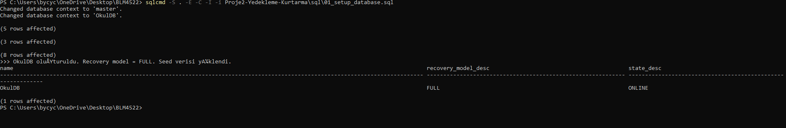
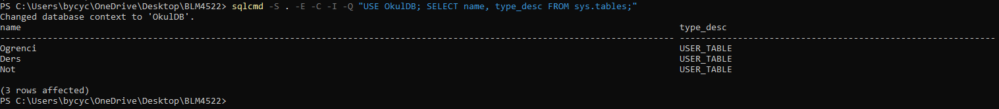
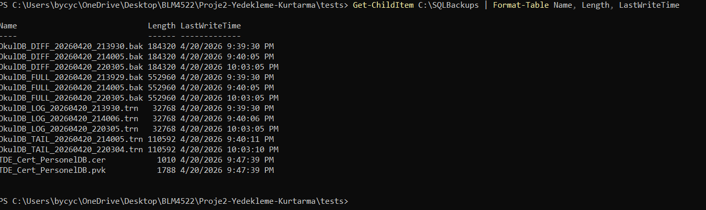
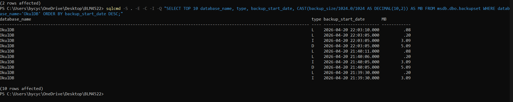
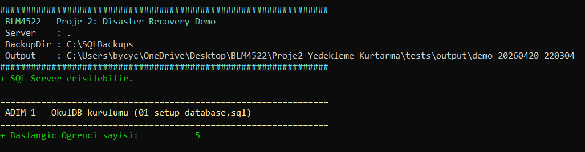
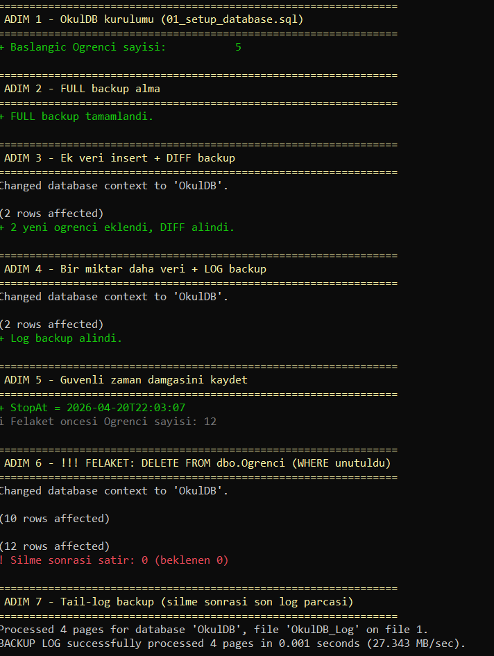
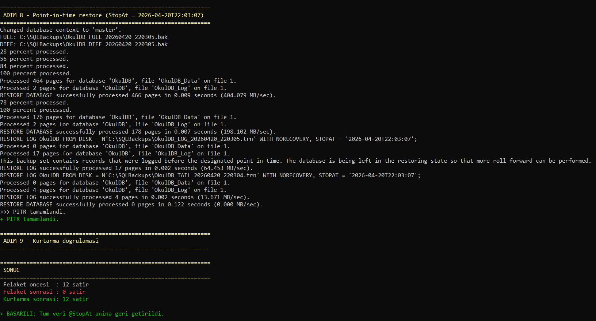
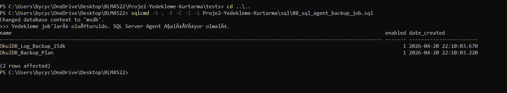
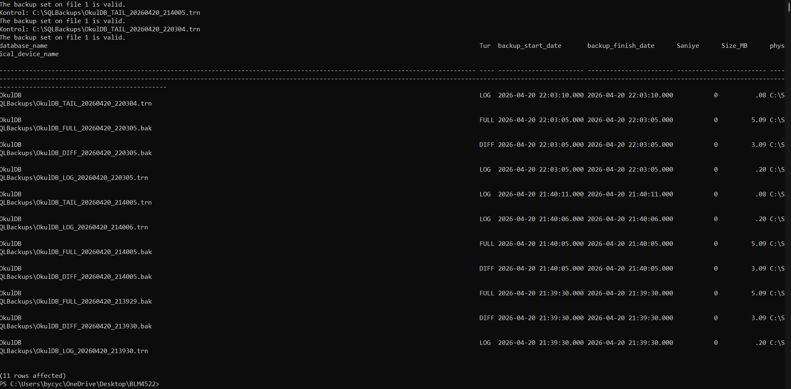

# Proje 2 — Veritabanı Yedekleme ve Felaketten Kurtarma Planı

**Ders:** BLM4522 — Ağ Tabanlı Paralel Dağıtım Sistemleri
**Öğrenci:** Ömer Doğan
**Platform:** Microsoft SQL Server
**Örnek Veritabanı:** `OkulDB` (proje kapsamında oluşturulmuştur)

---

## 1. Projenin Amacı ve Kapsamı

Veritabanları, bir kurumun en kritik bilgi varlığıdır. Donanım arızası, insan hatası (yanlışlıkla silme), yazılım hatası, ya da siber saldırı gibi sebeplerle veri kaybı yaşanabilir. Bu projenin amacı:

1. **SQL Server'ın yedekleme mekanizmalarını** (Full, Differential, Transaction Log) uygulamalı olarak öğrenmek.
2. **Farklı kurtarma senaryolarında** (tam geri yükleme, point-in-time restore, yanlışlıkla silme) kayıp veriyi geri getirmek.
3. **Yedekleme süreçlerini otomatikleştirmek** için SQL Server Agent kullanmak.
4. **Yedeklerin bütünlüğünü doğrulamak** için test stratejileri geliştirmek.

## 2. Teorik Arka Plan

### 2.1 Yedekleme Türleri

| Tür | Kapsam | Tipik Sıklık | Restore için Gereken |
|------|--------|---------------|----------------------|
| **Full (Tam)** | Veritabanının tamamı | Haftalık | Sadece kendisi |
| **Differential (Fark)** | Son FULL'dan bu yana değişenler | Günlük | Son FULL + son DIFF |
| **Transaction Log** | Son yedekten bu yana tüm işlemler | 5-15 dk | FULL + (DIFF) + tüm LOG zinciri |

### 2.2 Recovery Model

| Model | Log Tutumu | Log Backup | PITR |
|-------|-----------|------------|------|
| **SIMPLE** | Checkpoint'te truncate | Alınamaz | Hayır |
| **FULL** | Log backup'a kadar tutulur | Alınır | Evet |
| **BULK_LOGGED** | Çoğunlukla FULL, bulk op'larda minimal | Alınır | Kısıtlı |

**Seçimimiz:** Bu projenin tüm senaryolarını çalıştırabilmek için `RECOVERY FULL` seçildi.

### 2.3 Database Mirroring (Kısa Değini)

Database Mirroring, bir veritabanının "asıl (principal)" ve "yansıtıcı (mirror)" kopyalarını eş zamanlı tutarak yüksek erişilebilirlik sağlar. Microsoft artık bu özelliği **Always On Availability Groups** ile değiştirmiş olsa da, felaket kurtarma stratejisinde konsept olarak hâlâ önemlidir. Bu projede lisans sınırlamaları nedeniyle uygulanmamış, rapor bölümünde mimari olarak açıklanmıştır (bkz. §9).

## 3. Ortam Kurulumu

### 3.1 Gereksinimler

- Windows 10/11
- SQL Server 2019+ (Developer Edition yeterlidir)
- SQL Server Agent servisi çalışıyor olmalı
- `C:\SQLBackups` klasörü (script otomatik oluşturuyor)
- `C:\SQLData` klasörü (DB dosyaları için)

### 3.2 Servisleri Başlatma

```powershell
# Yönetici olarak:
net start MSSQLSERVER
net start SQLSERVERAGENT
```

### 3.3 Script'leri Çalıştırma

Bütün script'ler `sql/` klasöründedir. Çalıştırma sırası:

```bash
cd Proje2-Yedekleme-Kurtarma/sql
sqlcmd -S . -E -C -i 01_setup_database.sql
sqlcmd -S . -E -C -i 02_full_backup.sql
sqlcmd -S . -E -C -i 03_differential_backup.sql
sqlcmd -S . -E -C -i 04_log_backup.sql
# Senaryo testleri için:
sqlcmd -S . -E -C -i 07_accidental_delete_scenario.sql
# Kurtarma:
sqlcmd -S . -E -C -i 06_restore_point_in_time.sql
# Otomasyon:
sqlcmd -S . -E -C -i 08_sql_agent_backup_job.sql
# Doğrulama:
sqlcmd -S . -E -C -i 09_verify_backups.sql
```

## 4. Veritabanı Şeması

`OkulDB` üç tablolu basit bir okul yönetim şemasıdır:

- `Ogrenci(OgrenciID, Ad, Soyad, Numara, Bolum, KayitTarihi)`
- `Ders(DersID, DersKodu, DersAdi, Kredi)`
- `Not(NotID, OgrenciID, DersID, Vize, Final, Ortalama)`

`Ortalama` sütunu, **PERSISTED computed column** olarak tanımlanmıştır (Vize × 0.4 + Final × 0.6). Bu, yedekleme sırasında fiziksel olarak saklanır, restore sonrası hesaplama gerektirmez.


*Ekran 1 — `01_setup_database.sql` çıktısı. Veritabanı FULL recovery modelde oluşturuldu, seed verisi yüklendi.*


*Ekran 2 — `sys.tables` sorgusu. `Ogrenci`, `Ders`, `[Not]` tabloları oluşmuş.*

## 5. Yedekleme Stratejisi

Kurumsal bir ortam için önerilen üç kademeli strateji uygulanmıştır:

```
Pazar 02:00     -> FULL (haftalık)
Pzt-Cmt 02:00   -> DIFFERENTIAL (günlük)
Her 15 dakikada -> TRANSACTION LOG
```

**Bu planın gerekçeleri:**
- **RPO (Recovery Point Objective) = 15 dakika:** Olası veri kaybı penceresi en fazla bir log backup aralığıdır.
- **RTO (Recovery Time Objective) = dakikalar:** Restore = 1 FULL + 1 DIFF + N LOG. Diff kullanımı, tüm haftalık log'ları sırayla uygulamaktan çok daha hızlıdır.
- **Disk tasarrufu:** COMPRESSION kullanılmıştır; çoğu DB için %60-75 boyut azalışı sağlar.

### 5.1 Fiziksel Yedek Dosyaları


*Ekran 3 — `C:\SQLBackups` içinde oluşan `.bak` (FULL/DIFF) ve `.trn` (LOG) dosyaları. İsimlendirme `OkulDB_<TYPE>_<tarih_saat>.bak` formatında.*

### 5.2 Yedek Geçmişi (msdb.dbo.backupset)


*Ekran 4 — `msdb.dbo.backupset` üzerinden alınan son yedekler. `type` sütununda `D` = FULL, `I` = DIFF, `L` = LOG. Compression etkin olduğu için dosyalar küçük.*

## 6. Senaryo: Yanlışlıkla Silinen Veriyi Geri Getirme

### 6.1 Senaryo Anlatımı

Bir öğrenci işleri personeli, "öğrencileri temizle" niyetiyle yazacağı sorguda WHERE koşulunu unutarak şunu çalıştırıyor:

```sql
DELETE FROM dbo.Ogrenci;  -- WHERE unutuldu!
```

Tablonun tamamı boşalıyor. Uygulama hata veriyor, kullanıcılar arıyor, panik başlıyor.

### 6.2 Kurtarma Adımları

1. **Felaket anını öğren** — SQL Server logları veya kullanıcı raporundan (`07_accidental_delete_scenario.sql` bu anı `SYSDATETIME()` ile kaydediyor).
2. **Yeni işlemi durdur** — Uygulama bağlantıları kesilir: `ALTER DATABASE OkulDB SET SINGLE_USER WITH ROLLBACK IMMEDIATE;`
3. **Tail-log backup al** — Henüz yedeklenmemiş son log kısmını yedekle. Böylece tüm LSN zinciri elde edilir:
   ```sql
   BACKUP LOG OkulDB TO DISK = N'C:\SQLBackups\OkulDB_TAIL.trn' WITH NO_TRUNCATE, INIT;
   ```
4. **Point-in-time restore uygula** (`06_restore_point_in_time.sql`):
   - FULL + DIFF'i NORECOVERY ile yükle.
   - Tüm LOG yedeklerini sırayla NORECOVERY ile uygula.
   - **Son log**'u `STOPAT = 'felaket anından 1 sn önce'` ile uygula.
   - `RESTORE DATABASE OkulDB WITH RECOVERY` → DB kullanıma açılır.
5. **Doğrula** — `SELECT COUNT(*) FROM dbo.Ogrenci` ile satır sayısı beklenen değerde mi?

### 6.3 Kritik Not: Tail-Log Backup

Felaket sonrası **hiçbir işlem yapmadan** mutlaka tail-log backup alınmalıdır. Aksi halde felaket anından son log backup'ına kadar olan işlemler kaybolur.

### 6.4 Otomatik Demo ile Canlı Kanıt

Senaryonun tamamı `tests/disaster-recovery-demo.ps1` script'i ile tek komutta uçtan uca çalıştırılabilir. Demo sırasıyla: kurulum → FULL → veri + DIFF → veri + LOG → zaman damgası → felaket (DELETE) → tail-log → PITR → satır sayısı doğrulaması yapar.


*Ekran 5 — Demo'nun ara aşaması: Felaket öncesi `Ogrenci` tablosunda 12 satır mevcut ve güvenli an `@StopAt` olarak kaydedildi.*


*Ekran 6 — Point-in-Time Restore aşaması: FULL + DIFF + birden fazla LOG sırayla `NORECOVERY` ile uygulanıyor, son LOG `STOPAT` ile noktalanıyor.*


*Ekran 7 — Demo sonucu: Felaket öncesi 12, felaket sonrası 0, kurtarma sonrası 12 satır. PITR zinciri kayıpsız tamamlandı.*

## 7. Otomasyon (SQL Server Agent)

`08_sql_agent_backup_job.sql` iki job oluşturur:

### Job 1: `OkulDB_Backup_Plan`
- **Schedule:** Her gün 02:00
- **Adım 1:** Haftanın gününe göre dallanır — Pazar ise FULL al, değilse geç.
- **Adım 2:** Pazar dışında DIFF al.

### Job 2: `OkulDB_Log_Backup_15dk`
- **Schedule:** Her 15 dakikada bir, 00:00-23:59.
- **Adım:** LOG backup al.

### Hata Bildirimi

Üretim ortamında her job'a `@notify_level_email` ve `@notify_email_operator_name` parametresi eklenir. Bu, başarısız yedekte sistem yöneticisine e-posta gönderir. Bu projenin lab ortamında SMTP yapılandırılmadığı için raporda yalnızca yöntem gösterilmiştir:

```sql
EXEC msdb.dbo.sp_update_job
    @job_name = N'OkulDB_Backup_Plan',
    @notify_level_email = 2,   -- 2 = fail, 3 = always
    @notify_email_operator_name = N'DBA_Operator';
```

### Oluşturulan Job'ların Görünümü


*Ekran 8 — `08_sql_agent_backup_job.sql` çalıştıktan sonra `msdb.dbo.sysjobs` üzerinde görünen iki job: `OkulDB_Backup_Plan` (günlük FULL/DIFF) ve `OkulDB_Log_Backup_15dk` (her 15 dk LOG).*

## 8. Yedeklerin Doğruluğunun Test Edilmesi

Bir yedek, **restore edilene kadar** güvenilir değildir. Üç katmanlı doğrulama stratejisi (`09_verify_backups.sql`):

1. **`RESTORE VERIFYONLY ... WITH CHECKSUM`** — yedek dosyasının okunabilirliğini ve sayfa checksum'larını kontrol eder (restore etmez).
2. **`RESTORE HEADERONLY`** — medya içeriğini listeler (hangi DB, ne zaman alınmış, hangi LSN aralığı).
3. **Restore + `DBCC CHECKDB`** — yedeği ayrı bir DB adına restore et, DBCC ile bütünlük testi yap. Kurumsal ortamlarda bu, haftada bir otomatikleştirilir.


*Ekran 9 — `09_verify_backups.sql` çıktısı: `VERIFYONLY` başarılı, `HEADERONLY` medya bilgilerini listeliyor, test DB'sinde `DBCC CHECKDB` temiz.*

## 9. Felaket Kurtarma Mimari Notu (Database Mirroring / Always On)

Bu proje lokal bir sunucuda çalışır, bu nedenle replikasyon uygulanmamıştır. Ancak gerçek bir sistemde ek olarak şunlar gerekir:

- **Always On Availability Group** — primary sunucu çökerse secondary otomatik devralır (dakikalar değil saniyeler içinde RTO).
- **Off-site yedek** — yedek dosyaları farklı bir fiziksel lokasyona (veya bulut: Azure Blob Storage) kopyalanır. Aynı binanın yanması halinde yedekler korunur.
- **Periyodik felaket tatbikatı** — altı ayda bir, tamamen sıfırdan restore senaryosu canlandırılır.

## 10. Sonuç

Proje kapsamında:
- `OkulDB` örnek veritabanı sıfırdan oluşturulmuş, FULL recovery model'e alınmıştır.
- FULL + DIFF + LOG yedekleme zinciri uygulanmıştır.
- Yanlışlıkla silme senaryosu canlandırılmış ve point-in-time restore ile geri getirilmiştir.
- Yedekleme süreçleri SQL Server Agent ile tam otomatik hale getirilmiştir.
- Yedek dosyalarının güvenilirliği üç katmanlı doğrulama ile test edilmiştir.

Tüm adımlar [sql/](./sql) klasöründeki script'lerde belgelenmiş ve `.sql` dosyalarında yorumlarla açıklanmıştır.

## 11. Referanslar

- Microsoft Docs — Backup Overview (SQL Server): https://learn.microsoft.com/sql/relational-databases/backup-restore/
- Microsoft Docs — Recovery Models: https://learn.microsoft.com/sql/relational-databases/backup-restore/recovery-models-sql-server
- Microsoft Docs — SQL Server Agent: https://learn.microsoft.com/sql/ssms/agent/sql-server-agent

## 12. Ekran Görüntüleri Dizini

Tüm ekran görüntüleri [docs/](./docs/) klasöründe bulunur. Rapor içindeki sıraya göre listelenmişlerdir.

| # | Dosya | Açıklama |
|---|-------|----------|
| 1 | [01-database-olusturuldu.png](./docs/01-database-olusturuldu.png) | `OkulDB` kurulum çıktısı (FULL recovery model) |
| 2 | [02-tablolar.png](./docs/02-tablolar.png) | `sys.tables` — `Ogrenci`, `Ders`, `[Not]` tabloları |
| 3 | [03-backup-dosyalari.png](./docs/03-backup-dosyalari.png) | `C:\SQLBackups` klasöründeki `.bak` ve `.trn` dosyaları |
| 4 | [06-backup-history.png](./docs/06-backup-history.png) | `msdb.dbo.backupset` üzerinden alınan yedek geçmişi |
| 5 | [04-demo-basarili1.png](./docs/04-demo-basarili1.png) | Demo ara aşaması — felaket öncesi 12 satır |
| 6 | [04-demo-basarili2.png](./docs/04-demo-basarili2.png) | Demo PITR aşaması — FULL + DIFF + LOG zinciri |
| 7 | [04-demo-basarili3.png](./docs/04-demo-basarili3.png) | Demo başarı özeti — tüm veri geri getirildi |
| 8 | [05-agent-jobs.png](./docs/05-agent-jobs.png) | SQL Server Agent job listesi |
| 9 | [07-verify.png](./docs/07-verify.png) | `RESTORE VERIFYONLY` + `DBCC CHECKDB` doğrulama çıktısı |

---

*Bu rapor, çalıştırılabilir T-SQL script'leri ve canlı ortamda alınmış ekran görüntüleri ile desteklenmektedir.*
