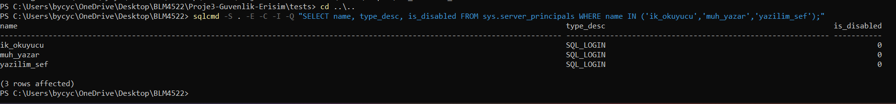
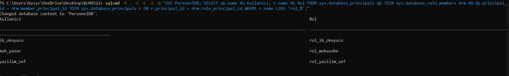
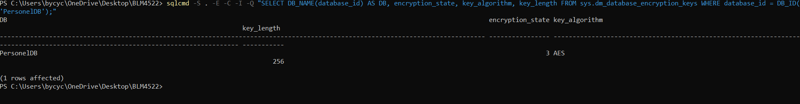
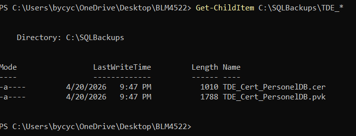
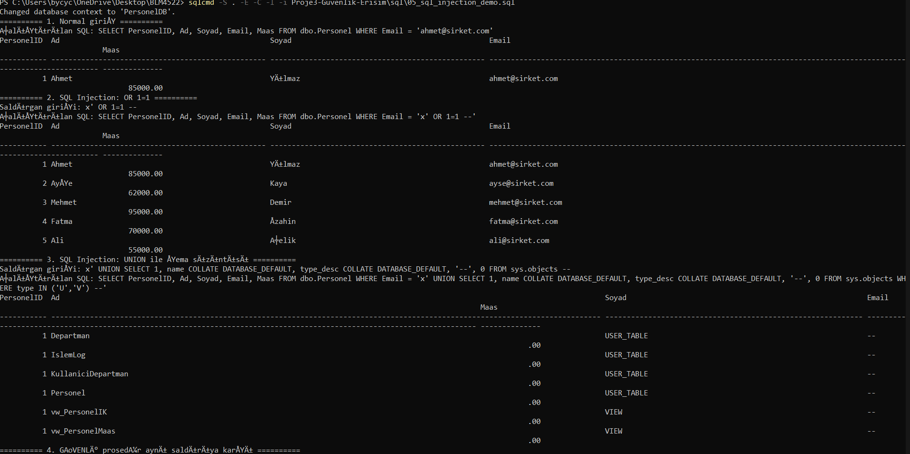
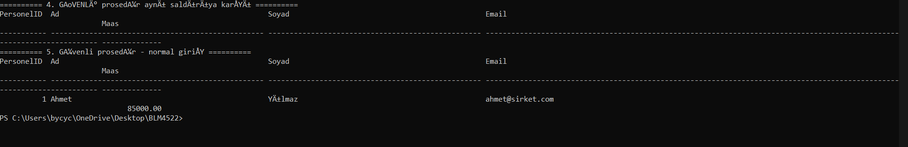
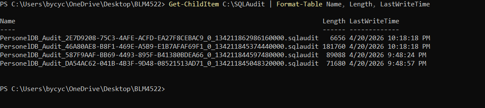
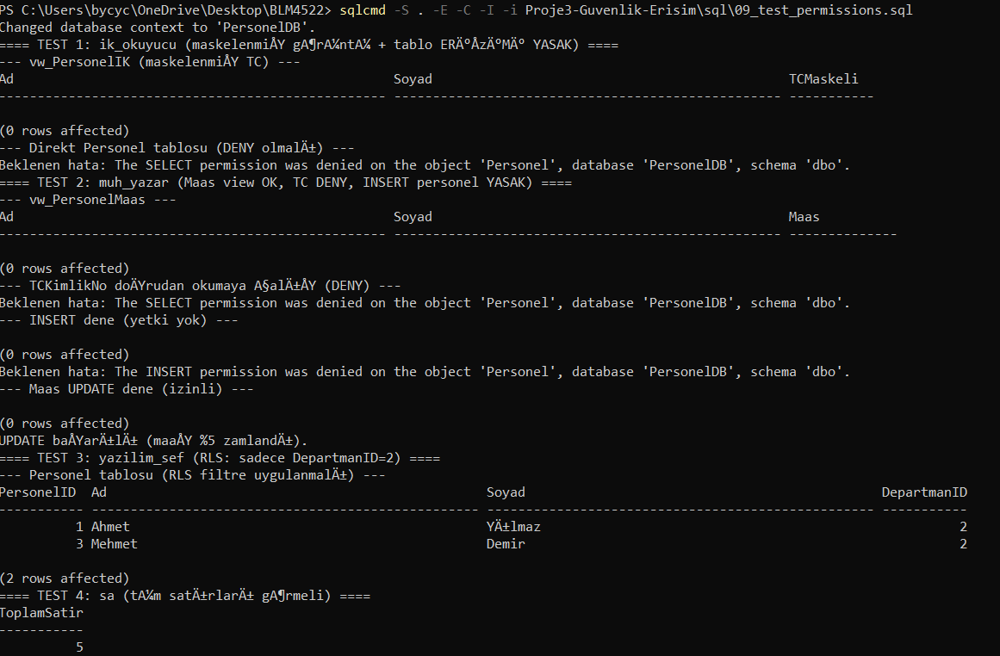
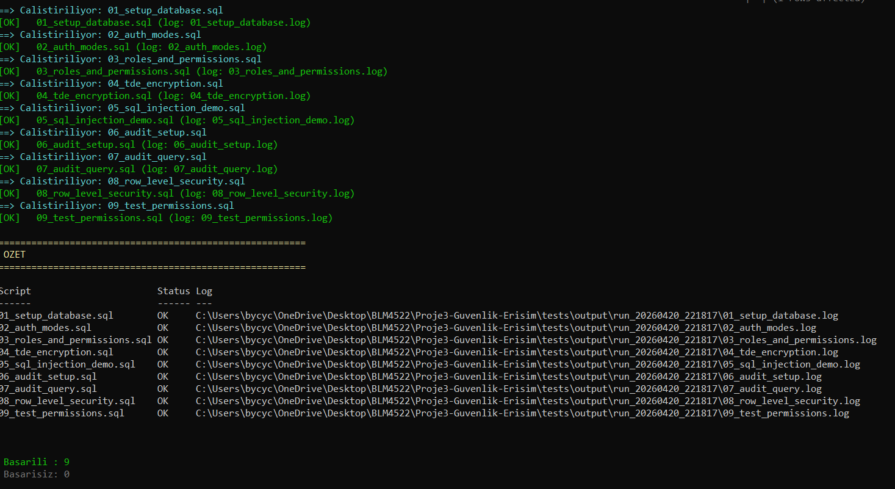

# Proje 3 — Veritabanı Güvenliği ve Erişim Kontrolü

**Ders:** BLM4522 — Ağ Tabanlı Paralel Dağıtım Sistemleri
**Öğrenci:** Ömer Doğan
**Platform:** Microsoft SQL Server
**Örnek Veritabanı:** `PersonelDB` (proje kapsamında oluşturulmuştur)

---

## 1. Projenin Amacı

Modern kurumlarda veritabanı, en değerli ve en çok saldırılan katmandır. Bu projenin amacı SQL Server'ın güvenlik özelliklerini **uçtan uca** bir mini-sistem üzerinde uygulamak:

1. **Kimlik Doğrulama (Authentication)** — kim bağlanabilir?
2. **Yetkilendirme (Authorization)** — bağlandıktan sonra neyi yapabilir?
3. **Şifreleme (Encryption)** — disk veya network seviyesinde veri korunur mu?
4. **Saldırı Savunması** — SQL Injection gibi yaygın saldırılara karşı kod nasıl yazılmalı?
5. **Denetim (Audit)** — olay sonrası kim ne yaptı izlenebiliyor mu?
6. **Satır Düzeyinde Güvenlik (RLS)** — aynı tabloyu kullanan farklı ekipler birbirinin verisini görmesin.

## 2. Defense-in-Depth (Katmanlı Savunma)

Tek bir güvenlik mekanizması yeterli değildir; her katman bağımsız çalışmalıdır:

```
┌──────────────────────────────────────────────────────────────┐
│ 1. AĞ KATMANI      : Firewall, VPN, port kısıtı (1433)       │
├──────────────────────────────────────────────────────────────┤
│ 2. KİMLİK          : Windows Auth / SQL Auth + güçlü parola  │
├──────────────────────────────────────────────────────────────┤
│ 3. YETKİ           : Rol tabanlı, en az yetki ilkesi         │
├──────────────────────────────────────────────────────────────┤
│ 4. KOD SEVİYESİ    : Parameterized query, sp'ler, input val. │
├──────────────────────────────────────────────────────────────┤
│ 5. ŞİFRELEME       : TDE (data-at-rest), TLS (data-in-tran.) │
├──────────────────────────────────────────────────────────────┤
│ 6. DENETİM         : SQL Server Audit, uzak log toplama      │
└──────────────────────────────────────────────────────────────┘
```

## 3. Ortam ve Şema

`PersonelDB` — bir şirketin personel kayıtlarını tutan basit bir model:

- `Departman(DepartmanID, DepartmanAdi)`
- `Personel(PersonelID, TCKimlikNo, Ad, Soyad, Email, Telefon, Maas, IseBaslamaTarihi, DepartmanID)`
- `IslemLog(LogID, Zaman, Kullanici, Islem, Aciklama)`

**Hassas sütunlar:** `TCKimlikNo`, `Maas`. Bu sütunların kimler tarafından, hangi formatta okunabileceği projenin merkezi sorusudur.

## 4. Authentication (Kimlik Doğrulama) — [`02_auth_modes.sql`](./sql/02_auth_modes.sql)

### 4.1 İki Mod

| Mod | Avantaj | Dezavantaj |
|------|---------|------------|
| **Windows Auth** | Merkezi yönetim (AD), parola sızmaz | Windows olmayan istemci zor |
| **SQL Auth** | Platform bağımsız | Parola SQL'de saklanır, korunmalı |

**Öneri:** Mümkünse Windows Auth tercih edilir. Mixed Mode yalnızca harici servisler/uygulamalar için açılmalıdır.

### 4.2 Oluşturulan Loginler

Üç farklı rol için üç SQL login oluşturuldu:

| Login | Amaç | Parola Politikası |
|-------|------|-------------------|
| `ik_okuyucu` | İK personeli, sadece görüntüleme | `CHECK_POLICY = ON`, `CHECK_EXPIRATION = ON` |
| `muh_yazar` | Muhasebe, maaş güncelleme | Aynı |
| `yazilim_sef` | Yazılım departmanı şefi | Aynı |

`CHECK_POLICY = ON`, Windows'un lokal/domain parola politikasını SQL loginine de uygular: uzunluk, karmaşıklık, history vb.



## 5. Authorization (Yetkilendirme) — [`03_roles_and_permissions.sql`](./sql/03_roles_and_permissions.sql)

### 5.1 Rol Tabanlı Erişim (RBAC)

Üç rol oluşturuldu ve kullanıcılar bu rollere atandı:

| Rol | Üye | Yetki |
|-----|-----|-------|
| `rol_ik_okuyucu` | `ik_okuyucu` | `vw_PersonelIK` SELECT. `Personel` tablosu DENY. |
| `rol_muhasebe` | `muh_yazar` | `vw_PersonelMaas` SELECT/UPDATE. `Personel.TCKimlikNo` DENY. |
| `rol_yazilim_sef` | `yazilim_sef` | `Personel` SELECT/INSERT/UPDATE (RLS ile sınırlı). |

### 5.2 View'larla Sütun Maskeleme

İK personeli TC Kimlik No'nun tamamını **görmemelidir**. `vw_PersonelIK` view'i:

```sql
CONCAT(LEFT(TCKimlikNo, 3), '****', RIGHT(TCKimlikNo, 4)) AS TCMaskeli
```

İle maskelenmiş bir görünüm sunar. IK rolüne `Personel` tablosuna doğrudan erişim **DENY** edilmiştir.

### 5.3 GRANT / DENY / REVOKE Öncelikleri

- `DENY` her zaman `GRANT`'i ezer — bu yüzden "güvenlik kritik" sütunlarda açık DENY kullanılmıştır.
- Bir rol üyesi, başka bir rolden GRANT alsa da, tabloya DENY varsa erişemez.



## 6. Şifreleme — [`04_tde_encryption.sql`](./sql/04_tde_encryption.sql)

### 6.1 Transparent Data Encryption (TDE)

TDE, veritabanı sayfalarını (data + log + backup) **diske yazarken şifreler**, okurken çözer. Uygulama hiçbir değişikliğe uğramaz.

**Kullanım senaryosu:** Birisi datacenter'dan `.mdf`/`.bak` dosyalarını çalsa, başka bir sunucuya attach edemez; çünkü şifreleme anahtarı (sertifika) sadece orijinal sunucuda vardır.

### 6.2 Anahtar Hiyerarşisi

```
Service Master Key  (sunucu, otomatik)
  └─ Database Master Key (master DB, parola ile)
       └─ Certificate: TDE_Cert_PersonelDB
              └─ Database Encryption Key (DEK) in PersonelDB
                    └─ AES_256 ile sayfaları şifreler
```

### 6.3 Sertifika Yedeklemenin Önemi

`BACKUP CERTIFICATE ... TO FILE ...` komutu script'te mevcuttur. **Bu yedek olmadan, sertifika kaybolursa, TDE etkin veritabanı sonsuza dek açılamaz.** Sertifika ve private key dosyaları güvenli bir offline medyaya kopyalanmalıdır.





## 7. SQL Injection Saldırı Testleri — [`05_sql_injection_demo.sql`](./sql/05_sql_injection_demo.sql)

### 7.1 Savunmasız vs Güvenli Prosedür

**SAVUNMASIZ:**
```sql
DECLARE @sql NVARCHAR(MAX) =
    N'SELECT * FROM Personel WHERE Email = ''' + @email + N'''';
EXEC (@sql);
```

**GÜVENLİ:**
```sql
SELECT * FROM Personel WHERE Email = @email;   -- parameterized
```

### 7.2 Denenen Saldırılar

| # | Saldırı | Girdi | Savunmasızda Sonuç | Güvenlide Sonuç |
|---|---------|-------|-------------------|----------------|
| 1 | Tautology | `x' OR 1=1 --` | Tüm tablo sızar | Boş sonuç |
| 2 | UNION-based | `x' UNION SELECT ...` | Şema sızar | Boş sonuç |
| 3 | Normal giriş | `ahmet@sirket.com` | 1 satır | 1 satır |

### 7.3 Alınan Savunma Önlemleri

1. **Her sorgu parameterized olmalı** — string concat yasak.
2. **Dinamik SQL zorunluysa `sp_executesql` + parametre** kullanılır, `EXEC()` değil.
3. **Stored procedure** üzerinden erişim — uygulama tabloları doğrudan görmez.
4. **Input validation** — server-side whitelist, type check.
5. **Error messages** — prod'da hiçbir zaman SQL hata metni istemciye dönmemeli (bilgi sızıntısı).





## 8. SQL Server Audit — [`06_audit_setup.sql`](./sql/06_audit_setup.sql), [`07_audit_query.sql`](./sql/07_audit_query.sql)

### 8.1 Yapı

- **Server Audit** `PersonelDB_Audit` → `C:\SQLAudit\*.sqlaudit` dosyasına yazar (50 MB × 20 rollover).
- **Server Audit Specification** `Srv_Audit_Spec_Logins` → başarılı/başarısız login, logout.
- **Database Audit Specification** `DB_Audit_Spec_Personel` → `Personel` tablosuna tüm SELECT/INSERT/UPDATE/DELETE işlemleri + rol üyelik değişiklikleri.

### 8.2 Tipik Kullanım

```sql
-- Başarısız login denemeleri (brute-force tespiti)
SELECT event_time, server_principal_name, client_ip
FROM sys.fn_get_audit_file('C:\SQLAudit\*', DEFAULT, DEFAULT)
WHERE action_id = 'FLGF';
```

### 8.3 Üretim Notu

Audit log'ları DB admin'in değiştiremeyeceği, immutable bir **uzak log sunucusuna** (syslog / SIEM) gönderilmelidir. Aksi halde DB admin, bir kötüye kullanımı gizlemek için log'u silebilir.



## 9. Row-Level Security (RLS) — [`08_row_level_security.sql`](./sql/08_row_level_security.sql)

### 9.1 Amacı

Aynı sorgu, çalıştıran kullanıcıya göre farklı sonuç dönmeli. `yazilim_sef` → sadece Yazılım Geliştirme departmanı personelini görmeli.

### 9.2 Uygulama

1. **`KullaniciDepartman`** tablosu: hangi kullanıcı hangi departmanı yönetir.
2. **Inline TVF** `Security.fn_DepartmanFiltre(@DepartmanID)`: `IS_MEMBER('db_owner')` veya `SUSER_SNAME()` eşleşmesi varsa `1` döner.
3. **Security Policy** `PersonelRLS`: fonksiyonu `dbo.Personel` tablosuna `FILTER PREDICATE` olarak bağlar. `BLOCK PREDICATE AFTER INSERT` ise bir şefin başka departmana kayıt eklemesini engeller.

### 9.3 Sonuç

```sql
-- sa olarak: 5 satır
-- yazilim_sef olarak: 2 satır (sadece DepartmanID=2)
SELECT COUNT(*) FROM dbo.Personel;
```

## 10. Test Matrisi — [`09_test_permissions.sql`](./sql/09_test_permissions.sql)

Tüm yetkiler `EXECUTE AS USER = '...'` ile tek oturumda sırayla test edilir:

| Test | Kullanıcı | İşlem | Beklenen |
|------|-----------|-------|----------|
| 1 | `ik_okuyucu` | `vw_PersonelIK` SELECT | Maskelenmiş TC ile 5 satır |
| 1 | `ik_okuyucu` | `Personel` SELECT | HATA (DENY) |
| 2 | `muh_yazar` | `vw_PersonelMaas` SELECT | Maaşlar görünür |
| 2 | `muh_yazar` | `Personel.TCKimlikNo` SELECT | HATA (DENY) |
| 2 | `muh_yazar` | `Personel` INSERT | HATA (yetki yok) |
| 2 | `muh_yazar` | `vw_PersonelMaas` UPDATE | Başarılı |
| 3 | `yazilim_sef` | `Personel` SELECT | Sadece 2 satır (RLS) |
| 4 | `sa` | `Personel` COUNT | 5 (tümü) |





## 11. Sonuç

Proje kapsamında:
- İki kimlik doğrulama modu karşılaştırıldı ve güçlü parola politikası uygulanmış SQL loginleri kuruldu.
- Least-privilege ilkesi ile üç rol ve bu rollere özel view'lar tasarlandı.
- TDE ile veritabanı dosyaları AES-256 ile şifrelendi, sertifika güvenli bir şekilde yedeklendi.
- SQL Injection saldırıları simüle edildi ve parameterized query ile etkisizleştirildi.
- Server + DB seviyesinde audit yapılandırıldı, log'lar dosyadan sorgulanabilir hale getirildi.
- Row-Level Security ile çok kiracılı (multi-tenant) bir senaryo uçtan uca test edildi.

Tüm adımlar [sql/](./sql) klasöründeki script'lerde belgelenmiştir.

## 12. Referanslar

- Microsoft Docs — Security Center for SQL Server: https://learn.microsoft.com/sql/relational-databases/security/
- Microsoft Docs — Transparent Data Encryption (TDE): https://learn.microsoft.com/sql/relational-databases/security/encryption/transparent-data-encryption
- Microsoft Docs — SQL Server Audit: https://learn.microsoft.com/sql/relational-databases/security/auditing/sql-server-audit-database-engine
- Microsoft Docs — Row-Level Security: https://learn.microsoft.com/sql/relational-databases/security/row-level-security
- OWASP — SQL Injection Prevention Cheat Sheet: https://cheatsheetseries.owasp.org/cheatsheets/SQL_Injection_Prevention_Cheat_Sheet.html

## 13. Ekran Görüntüleri Dizini

Tüm görüntüler [`docs/`](./docs/) altında tutulmaktadır.

| # | Dosya | İçerik | Rapor Bölümü |
|---|-------|--------|--------------|
| 1 | [02-loginler.png](./docs/02-loginler.png) | Oluşturulan SQL loginleri (`ik_okuyucu`, `muh_yazar`, `yazilim_sef`) | §4.2 |
| 2 | [03-roller.png](./docs/03-roller.png) | Roller ve rol üyelikleri | §5.3 |
| 3 | [04-tde-aktif.png](./docs/04-tde-aktif.png) | `sys.dm_database_encryption_keys` — `encryption_state = 3` | §6.3 |
| 4 | [08-tde-sertifika.png](./docs/08-tde-sertifika.png) | `C:\SQLBackups\TDE_Cert_PersonelDB.cer/.pvk` yedek dosyaları | §6.3 |
| 5 | [05-sql-injection1.png](./docs/05-sql-injection1.png) | Tautology (`x' OR 1=1 --`) ile tüm tablonun sızması | §7.3 |
| 6 | [05-sql-injection2.png](./docs/05-sql-injection2.png) | UNION ile şema sızıntısı ve güvenli prosedürün boş sonucu | §7.3 |
| 7 | [07-audit-klasor.png](./docs/07-audit-klasor.png) | `C:\SQLAudit\` içindeki `.sqlaudit` dosyaları | §8.3 |
| 8 | [06-yetki-testleri.png](./docs/06-yetki-testleri.png) | `EXECUTE AS USER` ile DENY / GRANT davranışlarının testi | §10 |
| 9 | [08-test-runner-9-of-9.png](./docs/08-test-runner-9-of-9.png) | `tests/run-all.ps1` — 9/9 PASS özeti | §10 |

---

*Bu rapor, çalıştırılabilir T-SQL script'leri, test çıktıları ve yukarıdaki 9 ekran görüntüsü ile desteklenmektedir.*
